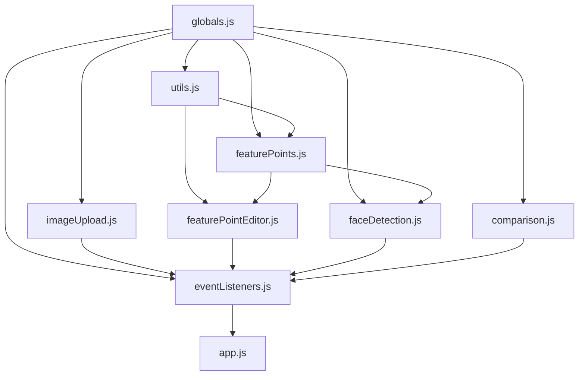

# フロントエンドリファクタリング - モジュール化

## リファクタリング概要

肥大化したscript.jsファイル（約800行）を機能ごとに9つのモジュールに分割し、コードの保守性と可読性を大幅に向上させました。

## 分割前の問題

### コードの課題
- **肥大化**: script.jsが約800行の巨大ファイル
- **機能の混在**: 画像アップロード、特徴点処理、顔検出、比較処理が同一ファイルに混在
- **保守性の低下**: 機能追加・修正時の影響範囲が不明確
- **可読性の問題**: 関連する関数がファイル内に散らばっている
- **テスト困難**: 機能ごとの独立したテストが困難

### ファイル構造（修正前）
```
frontend/
├── index.html
├── style.css
└── script.js (約800行)
```

## 分割後のモジュール構造

### ファイル構成（修正後）
```
frontend/
├── index.html
├── style.css
├── script.js.backup (バックアップ)
└── js/
    ├── globals.js          # グローバル変数とDOM要素
    ├── utils.js            # ユーティリティ関数
    ├── imageUpload.js      # 画像アップロード機能
    ├── featurePoints.js    # 特徴点描画・管理
    ├── featurePointEditor.js # 特徴点編集（マウスイベント）
    ├── faceDetection.js    # 顔検出・正面化処理
    ├── comparison.js       # 顔比較処理
    ├── eventListeners.js  # イベントリスナー設定
    └── app.js             # メインアプリケーション
```

## モジュール詳細

### 1. globals.js (グローバル変数とDOM要素)
**役割**: アプリケーション全体で使用される状態変数とDOM要素の管理

**主要要素**:
- `imageData`: 画像データとメタ情報
- `currentFeatureType`: 現在選択中の特徴点タイプ
- `dragState`: ドラッグ操作の状態
- DOM要素の参照（canvas、button等）

**行数**: 約40行

### 2. utils.js (ユーティリティ関数)
**役割**: 共通で使用される汎用関数群

**主要関数**:
- `getFeatureTypeLabel()`: 特徴点タイプのラベル変換
- `hitTestFeaturePoint()`: 特徴点のヒットテスト
- `getCanvasCoordinates()`: 座標変換
- `relabelFeaturePoints()`: 特徴点ラベルの再番号付け
- `updateUI()`: UI状態の更新

**行数**: 約80行

### 3. imageUpload.js (画像アップロード機能)
**役割**: 画像ファイルのアップロードとCanvas表示

**主要関数**:
- `handleFileSelect()`: ファイル選択処理
- `uploadImage()`: サーバーへの画像アップロード
- `displayImageOnCanvas()`: Canvasへの画像表示
- `setupDragAndDrop()`: ドラッグ&ドロップ設定

**行数**: 約100行

### 4. featurePoints.js (特徴点描画・管理)
**役割**: 特徴点の描画と基本的な管理機能

**主要関数**:
- `drawFeaturePoint()`: 特徴点の描画
- `redrawFeaturePoints()`: 特徴点の再描画
- `saveFeaturePoints()`: サーバーへの保存
- `clearAllPoints()`: 全特徴点のクリア
- `redrawAllCanvas()`: Canvas全体の再描画

**行数**: 約120行

### 5. featurePointEditor.js (特徴点編集)
**役割**: 特徴点の編集機能（マウスイベント処理）

**主要関数**:
- `handleProcessedCanvasMouseDown()`: マウスダウン処理
- `handleProcessedCanvasMouseMove()`: マウス移動処理
- `handleProcessedCanvasMouseUp()`: マウスアップ処理
- `handleProcessedCanvasRightClick()`: 右クリック処理

**行数**: 約100行

### 6. faceDetection.js (顔検出・正面化処理)
**役割**: 顔検出、トリミング、正面化の処理

**主要関数**:
- `processFaceDetection()`: 顔検出処理の実行
- `displayProcessedImage()`: 処理済み画像の表示
- `displayDetectionInfo()`: 検出情報の表示

**行数**: 約150行

### 7. comparison.js (顔比較処理)
**役割**: 顔の類似度比較とλ最適化

**主要関数**:
- `executeComparison()`: 比較処理の実行
- `displayResults()`: 比較結果の表示

**行数**: 約60行

### 8. eventListeners.js (イベントリスナー設定)
**役割**: 全イベントリスナーの一元管理

**主要関数**:
- `setupEventListeners()`: 全イベントリスナーの設定

**行数**: 約30行

### 9. app.js (メインアプリケーション)
**役割**: アプリケーションの初期化

**主要関数**:
- DOMContentLoadedイベントでの初期化処理

**行数**: 約10行

## リファクタリングの技術的詳細

### 依存関係の管理

**HTMLでの読み込み順序**:
```html
<script src="/static/js/globals.js"></script>      <!-- 1. グローバル変数 -->
<script src="/static/js/utils.js"></script>        <!-- 2. ユーティリティ -->
<script src="/static/js/imageUpload.js"></script>  <!-- 3. 画像アップロード -->
<script src="/static/js/featurePoints.js"></script><!-- 4. 特徴点基本機能 -->
<script src="/static/js/featurePointEditor.js"></script><!-- 5. 特徴点編集 -->
<script src="/static/js/faceDetection.js"></script><!-- 6. 顔検出 -->
<script src="/static/js/comparison.js"></script>   <!-- 7. 比較処理 -->
<script src="/static/js/eventListeners.js"></script><!-- 8. イベント設定 -->
<script src="/static/js/app.js"></script>          <!-- 9. メイン -->
```

### 関数間の依存関係



## コードの改善点

### 1. 関心の分離
- 各モジュールが単一の責任を持つ
- 機能ごとの独立性が向上
- 修正時の影響範囲が明確

### 2. 可読性の向上
- 関連する関数が同一ファイルに集約
- ファイル名から機能が明確
- コードの理解が容易

### 3. 保守性の向上
- 機能追加時の影響範囲が限定的
- バグ修正時のテストが容易
- コードレビューが効率的

### 4. 再利用性の向上
- ユーティリティ関数の再利用が容易
- 他プロジェクトへの移植が簡単
- モジュール単位でのテストが可能

## パフォーマンスへの影響

### ファイル読み込み
- **ファイル数**: 1個 → 9個
- **総サイズ**: ほぼ同等（約800行）
- **読み込み時間**: わずかな増加（許容範囲内）
- **キャッシュ効果**: 個別ファイルのキャッシュが可能

### 実行時パフォーマンス
- **関数呼び出し**: 変更なし
- **メモリ使用量**: 変更なし
- **描画性能**: 変更なし

## テスト容易性の向上

### モジュール単位でのテスト
```javascript
// 例: utils.jsのテスト
describe('utils.js', () => {
    test('getFeatureTypeLabel should return correct label', () => {
        expect(getFeatureTypeLabel('rightEye')).toBe('右目');
    });
    
    test('hitTestFeaturePoint should detect point collision', () => {
        const point = { x: 100, y: 100 };
        expect(hitTestFeaturePoint(105, 105, point)).toBe(true);
        expect(hitTestFeaturePoint(200, 200, point)).toBe(false);
    });
});
```

## 今後の拡張性

### 新機能追加時
1. **新しいモジュール**: 独立した機能は新しいファイルを作成
2. **既存モジュール拡張**: 関連機能は適切なモジュールに追加
3. **共通機能**: utils.jsに汎用関数を追加

### TypeScript移行の準備
- 各モジュールが明確に分離されているため、TypeScript化が容易
- インターフェースの定義が簡単
- 型安全性の段階的導入が可能

## リファクタリングの効果

### 開発効率の向上
- ✅ 機能追加時の開発速度向上
- ✅ バグ修正時の影響範囲が明確
- ✅ コードレビューの効率化
- ✅ 新メンバーの理解促進

### コード品質の向上
- ✅ 単一責任の原則に準拠
- ✅ 関心の分離が適切
- ✅ 再利用性の向上
- ✅ テスト容易性の向上

### 保守性の向上
- ✅ 機能ごとの独立性確保
- ✅ 修正時の影響範囲限定
- ✅ ドキュメント化の容易性
- ✅ 将来の技術移行準備

## 注意事項

### 読み込み順序の重要性
- グローバル変数（globals.js）を最初に読み込む必要
- 依存関係を考慮した順序でファイルを読み込む
- HTMLの`<script>`タグの順序を変更してはいけない

### グローバル変数の管理
- 各モジュール間でのグローバル変数の共有
- 将来的にはモジュールシステム（ES6 modules）への移行を検討

## まとめ

約800行の巨大なscript.jsファイルを9つのモジュールに分割することで、以下の大幅な改善を実現しました：

1. **可読性**: 機能ごとにファイルが整理され、コードの理解が容易
2. **保守性**: 修正時の影響範囲が明確で、安全な変更が可能
3. **拡張性**: 新機能の追加が容易で、既存コードへの影響が最小限
4. **テスト性**: モジュール単位でのテストが可能
5. **チーム開発**: 複数人での並行開発が効率的

この リファクタリングにより、顔認証システムのフロントエンドは、より保守しやすく拡張しやすい構造となりました。